# <a name="btcusdt-2h-timeframe-signal"></a><a name="_toc192513058"></a><a name="_toc192515959"></a>**BTCUSDT (2h Timeframe) Signal**
<a name="deskripsi"></a><a name="_toc192513059"></a>[BTCUSDT (2H TIMEFRAME) SIGNAL	1****](#_toc192515959)**

[**Deskripsi	2****](#_toc192515960)

[**Syarat & Ketentuan	3****](#_toc192515961)

[**Alur Kerja Aplikasi	4****](#_toc192515962)

[**Download & Installasi	5****](#_toc192515963)

[**(Tahap 1) Source Code	5****](#_toc192515964)

[(Cara 1) Git	5](#_toc192515965)

[(Cara 2) Download Manual	9](#_toc192515966)

[**(Tahap 2) Dependensi	12****](#_toc192515967)

[**(Tahap 3) Run	16****](#_toc192515968)

[**(Tahap 4) Peggunaan	18****](#_toc192515969)


## <a name="_toc192515960"></a>**Deskripsi**
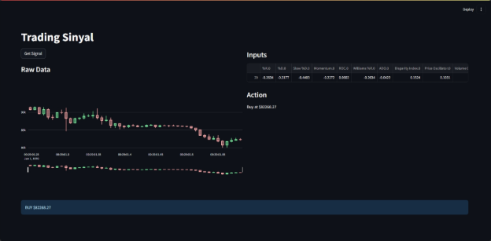

Aplikasi ini digunakan untuk menentukan sinyal trading pada pasangan BTC/USDT. Aplikasi ini memberikan output akhir berupa sinyal Hold, Buy, atau Sell.

Model dalam aplikasi ini menggunakan Neuroevolution of Augmenting Topologies (NEAT) untuk menghasilkan output. Model ini mengambil indikator teknikal dengan masing-masing ditambahkan dengan lag feature sebanyak 2 sebagai input.

Berikut daftar teknikal indikator yang digunakan:

- Stochastic Oscillator (%K, %D, Slow %D)
- Momentum (MO)
- ` `Rate of Change (ROC)
- Williams %R
- Accumulation Distribution Oscillator (ADO)
- Disparity Index
- Price Oscillator
- Volume Oscillator
- Aroon Oscillator (Aroon Up, Aroon Down, Aroon Oscillator)
- Relative Strength Index (RSI)
- Moving Average Convergence Divergence (MACD)

Aplikasi ini diharapkan dapat menjadi tambahan informasi dalam membantu pengambilan keputusan trading pengguna.

## <a name="syarat-ketentuan"></a><a name="_toc192513060"></a><a name="_toc192515961"></a>**Syarat & Ketentuan**
1. Aplikasi ini bukan merupakan trading bot. 
1. Aplikasi ini tidak direkomendasikan sebagai sumber saran keuangan tunggal.
1. Pengguna bertanggung jawab atas keputusan trading masing-masing.

## <a name="source-code"></a><a name="_toc192513061"></a><a name="_alur_kerja_aplikasi"></a><a name="_toc192515962"></a>**Alur Kerja Aplikasi**
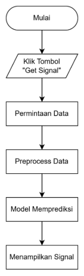

1. Aplikasi dimulai, pengguna membuka aplikasi. Hanya terdapat tombol untuk mendapatkan sinyal trading. 
1. Pengguna menekan tombol. Sistem mengirim permintaan ke API exchange. 
1. Menerima data dari API. Data ditampilkan dalam bentuk candlestick chart. 
1. Data diproses sesuai tahap yang dijelaskan pada bagian 4.1.1. Sistem menghasilkan 26 fitur sebagai input model. 
1. Model menentukan sinyal. Model memproses data dan menentukan sinyal trading. 
1. Menampilkan hasil. Aplikasi menampilkan sinyal beli, jual, atau tahan.

## <a name="_toc192515963"></a>**Download & Installasi**
Untuk dapat menggunakan aplikasi ini anda dapat mengikuti tahapan mulai dari bagian [source code](#_source_code), [dependensi](#_dependensi), [run](#_run), dan [penggunaan](#_peggunaan). Untuk penjelasan lebih lengkap ada dibawah ini.

## <a name="_source_code"></a><a name="_toc192515964"></a>**(Tahap 1) Source Code**
Untuk dapat menggunakan aplikasi ini, anda dapat mengunduh source code. Nanti dari proses bagian ini anda mendapatkan **folder** berupa source code aplikasi. Ada beberapa cara pengunduhan source code sebagai berikut:
### <a name="cara-1-git"></a><a name="_toc192513062"></a><a name="_toc192515965"></a>**(Cara 1) Git**
1. Buka command promp atau terminal lainnya. Hasilnya dapat dilihat pada gambar dibawah.

![ref1]

2. Pastikan git sudah terinstall di perangkat anda. Anda dapat menggunakan command:

```sh
git --version
```

Check Git Jika belum ada dapat melihat panduan berikut <https://git-scm.com/downloads>. Hasilnya dapat dilihat pada gambar dibawah.

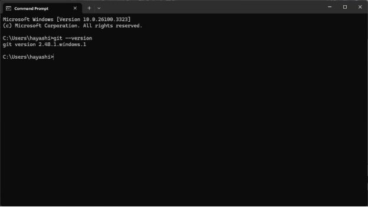

3. Jika git sudah terinstall, ganti direktori ke tempat anda ingin menyimpan project.

```sh
cd <save\_directory>
```

Anda dapat mengganti *<save\_directory>* dengan alamat direktori yang anda inginkan seperti cd Document. Hasilnya dapat dilihat pada gambar dibawah.

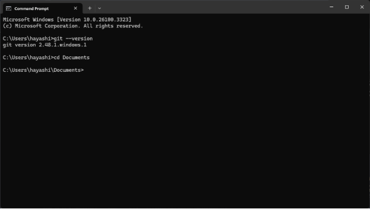

4. **Clone repository** dengan perintah berikut:

```sh
git clone https://github.com/hayashi19/BTCUSDT\_trade\_signal\_2h.git
```

Hasilnya dapat dilihat pada gambar dibawah.

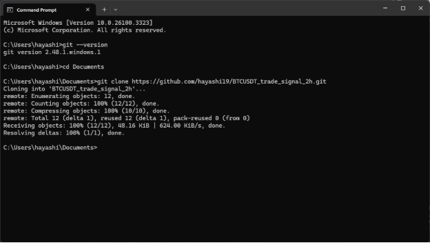

5. Masuk ke direktori proyek yang baru di-clone:

```sh
cd BTCUSDT\_trade\_signal\_2h
```

Hasilnya dapat dilihat pada gambar dibawah.

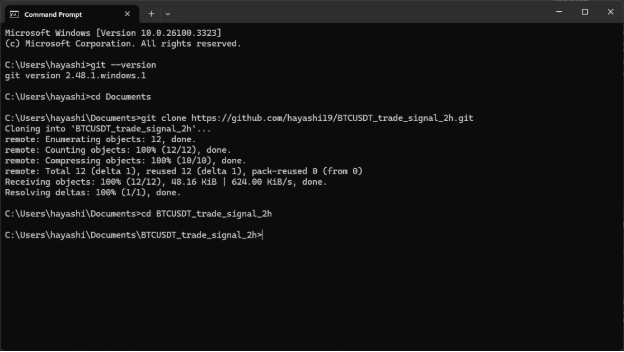

6. Lanjut ke installasi depedensi di bagian [Dependensi](#dependensi)
### <a name="cara-2-download-manual"></a><a name="_toc192513063"></a><a name="_toc192515966"></a>**(Cara 2) Download Manual**
1. Buka link berikut https://github.com/hayashi19/BTCUSDT\_trade\_signal\_2h.
2. Klik tombol code yang berwarna hijau. Hasilnya dapat dilihat pada gambar dibawah.

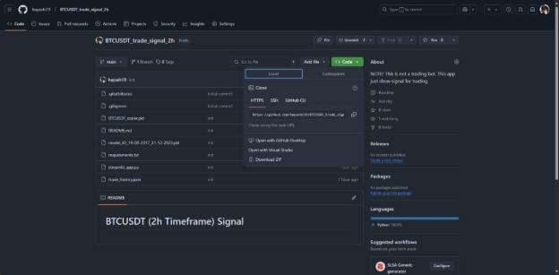

3. Klik tombol download zip yang diberi kotak merah. Hasilnya dapat dilihat pada gambar dibawah.

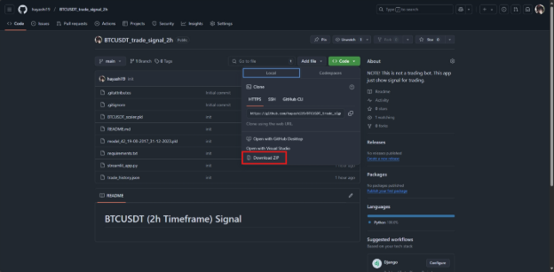

4. Extrak file zip (BTCUSDT\_trade\_signal\_2h) yang telah di download.
5. Pindahkan folder (BTCUSDT\_trade\_signal\_2h) ke direktori yang anda inginkan.
6. Copy path direktori folder. 

Contoh C:\Users\hayashi\Documents\BTCUSDT\_trade\_signal\_2h

7. Buka command promp atau terminal lainnya. Hasilnya dapat dilihat pada gambar dibaw

![ref1]

8. Pindah ke direktori folder (BTCUSDT\_trade\_signal\_2h).

```sh
cd <project\_directory>
```

Atau contoh cd C:\Users\hayashi\Documents\BTCUSDT\_trade\_signal\_2h CD.  Hasilnya dapat dilihat pada gambar dibawah.

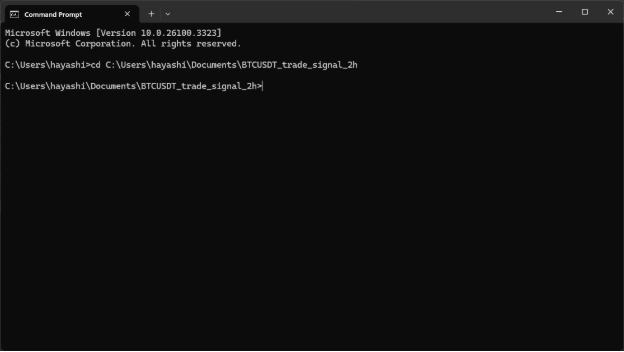

9. Lanjut ke installasi depedensi di bagian [Dependensi](#dependensi)
## <a name="dependensi"></a><a name="_toc192513064"></a><a name="_dependensi"></a><a name="_toc192515967"></a>**(Tahap 2) Dependensi**
Proses ini merupakan proses lanjutan dari bagian sebelumnya [Source Code](#source-code). Jika anda sudah mendapatkan **folder** source code maka anda dapat melanjutkannya dengan tahapan berikut:

1. Pastikan python tersedia pada perangkat anda.

```sh
python --version
```

Hasilnya dapat dilihat pada gambar dibawah.

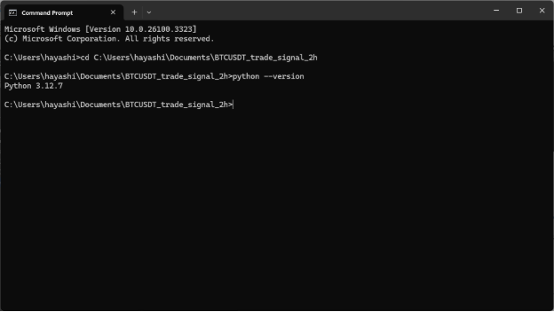

Jika belum ada anda dapat mengistall python lewat <https://www.python.org/downloads/>.

2. Buat virtual environment

```sh
python -m venv venv
```

Hasilnya dapat dilihat pada gambar dibawah.

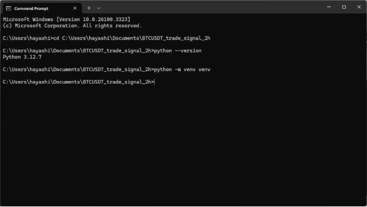

3. Aktifkan virtual environment

```sh
venv\Scripts\activate
```

Hasilnya dapat dilihat pada gambar dibawah.

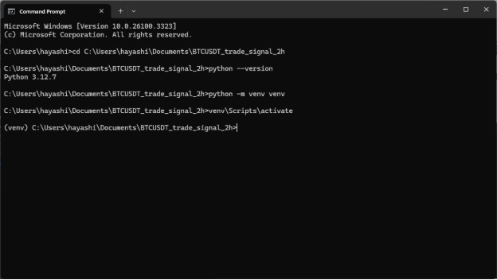

4. Instal dependensi dari ***requirements.txt***

```sh
pip install -r requirements.txt
```

<a name="_hlk192514731"></a>Hasilnya dapat dilihat pada gambar dibawah.

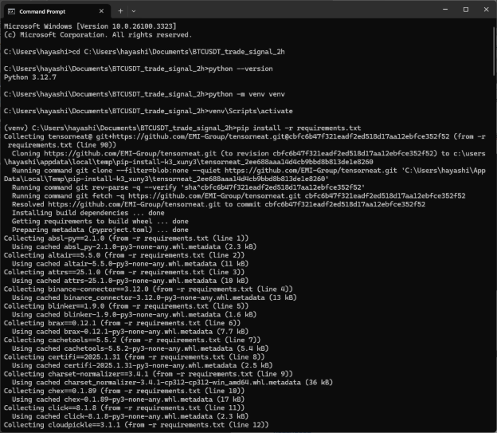

5. Lanjut menjalakan aplikasi di bagian [Run](#_run).

## <a name="run"></a><a name="_toc192513065"></a><a name="_run"></a><a name="_toc192515968"></a>**(Tahap 3) Run**
1. Jalakan perintah berikut

```sh
streamlit run streamlit\_app.py
```

Setelah scrip dijalanka maka akan terlihat alamat hosting untuk melihat tampilanya. Hasilnya dapat dilihat pada gambar dibawah.

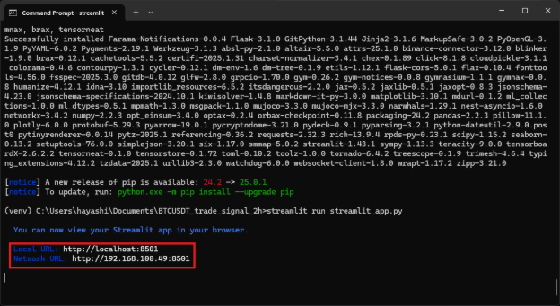

2. Klik salah satu link local maupun network, maka window browser baru akan terbuka. Hasilnya dapat dilihat pada gambar dibawah.

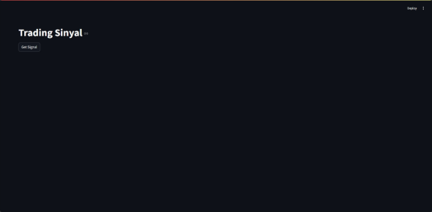

3. Penjelasan penggunaan dapat dilihat pada bagian [Penggunaan](#_peggunaan).

## <a name="_peggunaan"></a><a name="_toc192515969"></a>**(Tahap 4) Peggunaan**
4. Anda dengan mudah mendapatkan sinyal trading dengan cara menekan tombol **Get Signal.** Hasilnya dapat dilihat pada gambar dibawah.

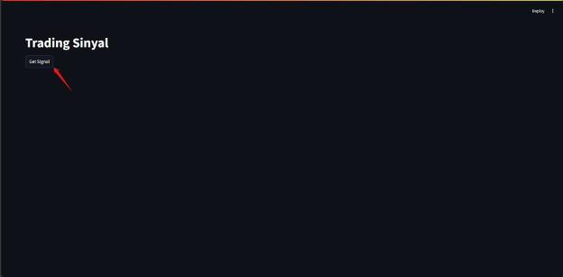

5. Maka aplikasi akan melakukan proses yang seperti dijelaskan pada bagian [alur kerja aplikasi](#_alur_kerja_aplikasi).
6. Dan hasilnya berupa sinyal trading *hold, buy*, atau *sell*. Hasilnya dapat dilihat pada gambar dibawah.

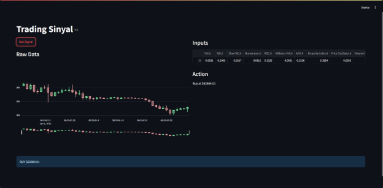

[ref1]: README/Aspose.Words.c86969ba-3f2a-4e57-a941-f4376290fe8f.003.png
